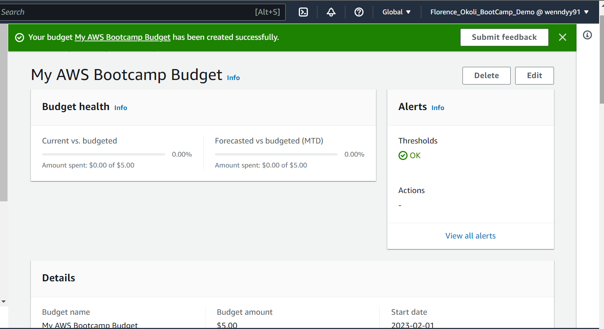

# Week 0 — Billing and Architecture

## Required Homework/Tasks

### Install AWS CLI

I was able to install CLI on Gitpod but couldn't run it as I encountered error.
I had to use AWS CLI on Cloudshell

### Create a Billing Alarm

### Create a Budget
I created my budget for the bootcamp for $5 because I'm concerned on spend

### Recreate a Logical Architecture Design
.png)

[Link for Lucid Chart](https://lucid.app/lucidchart/f100ecc4-9800-4dae-af2b-c35d6b99813c/edit?viewport_loc=-1354%2C-208%2C3369%2C1298%2C0_0&invitationId=inv_11155dd9-c32e-48d0-8798-3cc8dcdfa3e8)

